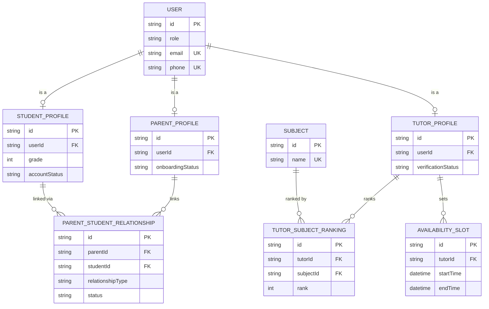
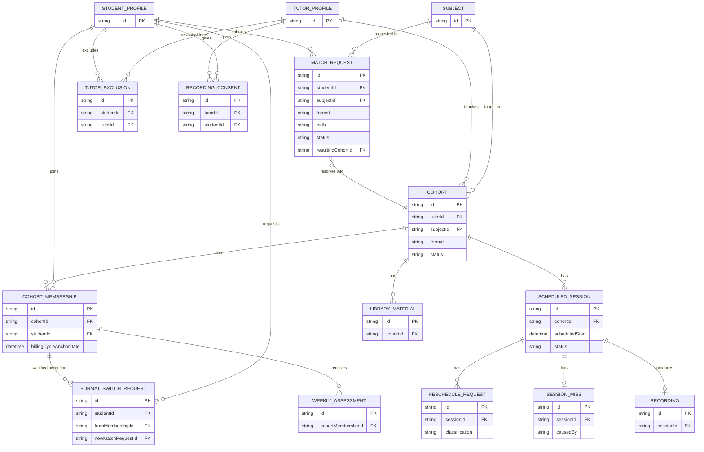
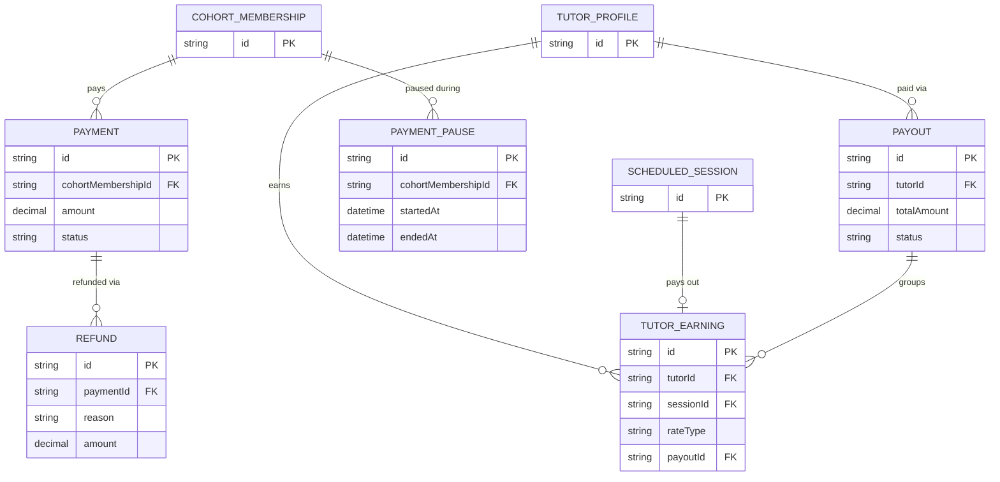
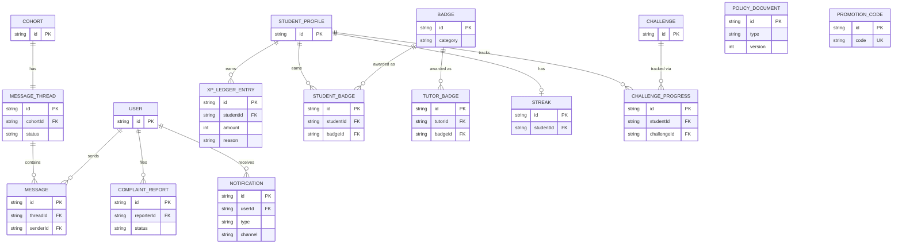

## Project: AKEWTutor — Online Tutoring Platform

**Links back to:** [01. Problem & Solution Statement], [02. Requirements], [03. Use Cases]
**Links forward to:** [05. Folder & File Structure], [06. API Specification]

This becomes `prisma/schema.prisma` (or equivalent ORM schema) almost line for line. Every entity below traces back to specific FR-xxx IDs (Doc 02) and use cases (Doc 03, UC-xx) — see each entity's "Traces to" line.

---

### 4.0 Design Decisions (finalized)

- **One base `User` table, plus a profile table per role.** Students, Parents, and Tutors each hold independent credentials (FR-AC-001), so authentication (email/phone, password hash, verification state) lives once on `User`, keyed by a `role` enum, while role-specific fields live on `StudentProfile` / `ParentProfile` / `TutorProfile` (1:1 with `User`). **Admin has no separate profile table** — an Admin is simply a `User` with `role = ADMIN`; there are no admin-specific fields beyond the base table, and no multi-tier admin permissions in V1 (mirroring the single-Admin-type decision in the reference project's schema).
- **`Cohort` unifies 1-to-1 and group formats.** Rather than modeling "a 1-to-1 match" and "a group class" as two different entities, a `Cohort` is the one confirmed-or-forming teaching assignment between one tutor and 1–5 students; a 1-to-1 match is simply a `Cohort` whose `CohortMembership` count never exceeds one. This lets `ScheduledSession`, `MessageThread`, `LibraryMaterial`, and billing all key off a single concept regardless of format, instead of duplicating that modeling per format.
- **`MatchRequest` models the pre-confirmation search state; `Cohort` models the confirmed-or-forming assignment.** A `MatchRequest` exists from the moment a student sets a format preference until a `Cohort` is formed and Admin-approved. This keeps "still searching / stuck / escalated" state (Path A/B) cleanly separate from "already assigned, now going through payment and scheduling" state (all paths, post-approval).
- **Billing is anchored per student, not per cohort.** `CohortMembership.billingCycleAnchorDate` — not a cohort-level field — because group members can join the same cohort at different times during the group-formation window (Section 7), and FR-PB-003/004 explicitly anchors each student's due date to *their own* first-paid-session date, not a shared cohort or platform date.
- **The leaderboard is a derived view, not a stored table.** Per-grade, per-period rankings (FR-GA-002) are computed by querying `XPLedgerEntry` joined to `StudentProfile.grade`, not persisted as their own entity — storing a second, denormalized ranking table would create a second source of truth that could drift from the ledger it's supposedly summarizing.
- **Stale-approval flags are computed, not stored as a status.** The 48-hour/5-day thresholds in Section 11.3 are derived at query time from `Cohort.createdAt` (or `MatchRequest.createdAt`) vs. now — only the two resulting notification events (`adminOverdueNotifiedAt`, `studentDelayNotifiedAt`) are persisted, purely as an audit trail of when each notification actually fired. This mirrors how the reference project derived pipeline health from `PipelineRun` timestamps instead of storing a redundant status field.
- **`SessionMiss` is separate from `ScheduledSession.status`.** A session's lifecycle status (scheduled/completed/missed/rescheduled) is distinct from *why* it was missed and *who* caused it — keeping fault attribution in its own table lets the tutor-escalation count (FR-MK-003) and the reduced make-up pay rate (FR-MK-009) both query it independently without overloading one status field with two concerns.
- **`RecordingConsent` is captured once per tutor–student pairing, not once per session.** This matches FR-SC-008's "one-time acknowledgment... before the first recorded session for that pairing," rather than requiring a fresh consent row for every class.
- **Session cadence (`Cohort.sessionsPerWeek`) is derived, not negotiated.** Rather than adding a booking-time "pick your schedule" step, cadence falls out of how many of the tutor's recurring `AvailabilitySlot` rows get matched into the Cohort's confirmed schedule, frozen at confirmation. This keeps `AvailabilitySlot` as the single source of truth for scheduling instead of introducing a second, potentially-conflicting cadence input (Section 7 v3.2 callout, Doc 02).
- **The billing cycle is a fixed 28-day window, not a true calendar month.** This makes `totalSessionsBilled = sessionsPerWeek × 4` exact and deterministic for every Cohort, which a true month (28–31 days, non-integer week count) could not guarantee. User-facing copy says "monthly"; the schema and billing math use the fixed 28-day figure.
- **No spatial/PostGIS concerns** — unlike the reference project, AKEWTutor has no map or grid component; nothing here needs geographic types.
- **All monetary fields are `Decimal`, never `Float`.** Prices, revenue splits, refunds, and payouts are real ETB currency, not scientific/statistical values (the opposite emphasis from the reference project, where signal/score values were correctly `Float`) — `Decimal` avoids floating-point rounding error in money math.
- **Primary keys are `String (UUID)` / `default uuid()`, not the template's `cuid()`.** This is a deliberate choice, not an oversight: Prisma supports `uuid()` natively, and UUIDs are the more broadly interoperable choice given the number of external integrations here (Chapa payments, Cloudflare R2, SMS/email providers) — the same reasoning that justifies departing from a template default elsewhere in this section (e.g. `Decimal` vs. `Float` above).
- **Enums are used wherever a fixed, closed set exists** (roles, statuses, `TutoringFormat`, evidence-adjacent categories, etc.), so that Admin-configurable pricing (FR-PR-004) and matching logic always validate against a known, closed format set rather than free text.
- **Grade levels are a plain integer field (1–12), not a separate entity.** Since FR-TU-006 confirms a tutor's ranked subjects apply across the *entire* Grade 1–12 span with no per-grade configuration, there is no `GradeLevel` table to join against — grade is just a bounded `Int` on `StudentProfile`, validated at the application layer.

**Remaining open items (finalized in principle, application-layer detail still pending):**
- Exact retry/backoff policy for a failed SMS/email notification delivery (FR-NO series) — the schema (`Notification.status`) supports retries, but the retry cadence itself is an application-layer decision, not a schema question.
- Exact rounding behavior for the 50% reduced make-up pay rate (FR-MK-009) when a tutor's normal share is an odd ETB amount — a `Decimal` field handles it either way; the rounding rule (round up/down/to nearest) should be settled before FR-MK-009 is implemented.
- Whether message-thread archiving (FR-MS-003, 90 days post-assignment) is a soft-delete flag or a genuine data-partitioning strategy for scale — both are compatible with the `MessageThread.status` design below; the choice is an infrastructure decision, not a schema question.

---

### 4.1 Entity List

| Domain | Entity | Purpose |
|---|---|---|
| Identity & Accounts | User | Base authenticated account (any role) — email/phone, password, verification state |
| Identity & Accounts | StudentProfile | A student's academic profile and account-state (1:1 with User) |
| Identity & Accounts | ParentProfile | A parent/guardian's account state (1:1 with User) |
| Identity & Accounts | TutorProfile | A tutor's qualification profile and verification state (1:1 with User) |
| Identity & Accounts | ParentStudentRelationship | The guardian-link between a Parent and a Student, with its own lifecycle |
| Identity & Accounts | RefreshToken | A rotating, single-use refresh token backing a User's session (NFR-014/015) |
| Catalog | Subject | One teachable subject (e.g., "Mathematics") |
| Catalog | TutorSubjectRanking | A tutor's ranked subject (max 2 per tutor), join of TutorProfile ↔ Subject |
| Availability | AvailabilitySlot | A block of time a tutor has marked available |
| Pricing | PricingConfig | The active price/revenue-split figures for one tutoring format, versioned |
| Matching | MatchRequest | A student's in-progress search/matching state, before a Cohort is confirmed |
| Matching | TutorExclusion | A tutor excluded from a student's next recommendation list after an Admin rejection |
| Matching & Delivery | Cohort | A confirmed-or-forming teaching assignment: one tutor, 1–5 students, one format |
| Matching & Delivery | CohortMembership | One student's membership in a Cohort, including their individual billing anchor |
| Matching | FormatSwitchRequest | A student-initiated request to change tutoring format mid-assignment |
| Class Delivery | ScheduledSession | One fixed-time class session belonging to a Cohort |
| Class Delivery | RescheduleRequest | A request to move a specific ScheduledSession's time |
| Class Delivery | SessionMiss | Fault-attributed record of a missed session (tutor-caused or student-caused) |
| Class Delivery | RecordingConsent | One-time recording-consent acknowledgment for a tutor–student pairing |
| Class Delivery | Recording | The metadata for one session's uploaded recording (file itself lives in object storage) |
| Class Delivery | LibraryMaterial | A tutor-uploaded PDF/note/book, visible to a Cohort's students |
| Assessment | WeeklyAssessment | A tutor's weekly feedback/assessment for one student |
| Messaging | MessageThread | The single message thread tied to one Cohort (pair or group) |
| Messaging | Message | One text message within a MessageThread |
| Payments | Payment | One payment transaction (via Chapa) |
| Payments | PaymentPause | A record of a student's schedule being paused for non-payment |
| Payments | Refund | An Admin-approved, prorated refund |
| Payments | TutorEarning | One session's earning credited to a tutor, at full or reduced rate |
| Payments | Payout | A monthly batch payout to a tutor, grouping TutorEarning rows |
| Gamification | XPLedgerEntry | One XP-earning event for a student (append-only ledger) |
| Gamification | Badge | A definition of an achievable badge (student or tutor) |
| Gamification | StudentBadge | A badge earned by a student |
| Gamification | TutorBadge | A badge earned by a tutor |
| Gamification | Streak | A student's current/longest consecutive-activity streak |
| Gamification | Challenge | A weekly/monthly engagement challenge definition |
| Gamification | ChallengeProgress | A student's progress toward one Challenge |
| Support & Trust | ComplaintReport | A complaint/claim/report filed by a student, parent, or tutor |
| Support & Trust | PolicyDocument | Versioned content for Privacy/Terms/Safety/Refund/Rules pages |
| Support & Trust | PromotionCode | An Admin-defined promotional discount |
| Notifications | Notification | One notification sent to one User through one channel |

---

### 4.2 Entity Detail

#### 4.2.1 Identity & Accounts

##### User

| Field | Type | Constraints | Notes |
|---|---|---|---|
| id | String (UUID) | PK, default uuid() | |
| role | Enum (UserRole) | required | `STUDENT \| PARENT \| TUTOR \| ADMIN` |
| email | String? | unique (nullable-safe), | required unless `phone` is set |
| phone | String? | unique (nullable-safe) | required unless `email` is set |
| passwordHash | String | required | bcrypt hash, never returned in API responses |
| emailVerifiedAt | DateTime? | nullable | Set once FR-SP-004 verification completes |
| phoneVerifiedAt | DateTime? | nullable | |
| preferredNotificationChannel | Enum (NotifChannel)? | nullable | `PUSH \| SMS \| EMAIL`; used across the whole FR-NO series |
| termsAcceptedAt | DateTime | required | Gate for FR-SP-005 / FR-TU-002 / FR-SC-001 |
| createdAt | DateTime | default now() | |
| updatedAt | DateTime | updatedAt | |

**Relations:** `studentProfile` (1:1, nullable), `parentProfile` (1:1, nullable), `tutorProfile` (1:1, nullable), plus every `...ById`/`...ByUserId` back-reference across the schema below (messages sent, notifications received, complaints filed, sessions triggered, etc.).

**Traces to:** FR-SP-001–005, FR-TU-001–002, FR-AC-001. UC-03, UC-06, UC-10, UC-11, UC-15.

Only one of `studentProfile` / `parentProfile` / `tutorProfile` is ever populated for a given `User`; which one is determined by `role` at registration and never changes afterward (a user wanting a different role registers a new account).

---

##### StudentProfile

| Field | Type | Constraints | Notes |
|---|---|---|---|
| id | String (UUID) | PK, default uuid() | |
| userId | String | FK → User.id, unique, required | |
| grade | Int | required, 1–12 | Determines Grades 1–5 vs. 6–12 account-model routing (FR-AC-002/005) |
| school | String? | nullable | |
| profilePictureUrl | String? | nullable | |
| subjectsOfInterest | Json | required, default `[]` | Array of Subject IDs (FR-SP-008) |
| academicLevel | String? | nullable | |
| learningGoals | String? | nullable | |
| preferredLanguage | String | required | Hard filter, all formats (Section 5.2 callout) |
| learningSchedulePreference | Json? | nullable | Free-form availability preference |
| teachingStylePreference | String? | nullable | Soft/scored factor, 1-to-1 only |
| budgetPreference | Decimal? | nullable | Hard filter, 1-to-1 search only (Section 5.4) |
| formatPreference | Enum (TutoringFormat)? | nullable | `ONE_TO_ONE \| ONE_TO_THREE \| ONE_TO_FIVE` — determines matching Path A/B vs. C |
| accountStatus | Enum (StudentAccountStatus) | required, default `PENDING_ACTIVATION` for Grades 1–5, `ACTIVE` for Grades 6–12 | `PENDING_ACTIVATION \| ACTIVE \| GUARDIAN_REQUIRED_HOLD` |
| createdAt | DateTime | default now() | |
| updatedAt | DateTime | updatedAt | |

**Relations:** `user` (1:1), `guardianRelationships` (one → many `ParentStudentRelationship`), `matchRequests`, `cohortMemberships`, `xpLedgerEntries`, `studentBadges`, `streak` (1:1), `challengeProgress`, `payments`, `paymentPauses`, `tutorExclusions`.

**Traces to:** FR-SP-007–010, FR-AC-002–005, FR-AC-008. UC-06, UC-13, UC-09.

`accountStatus = GUARDIAN_REQUIRED_HOLD` is the state introduced by FR-AC-008 — access is paused (enforced at the application layer against every booking/class-access check) but no related row anywhere in this schema is deleted when a student enters this state.

---

##### ParentProfile

| Field | Type | Constraints | Notes |
|---|---|---|---|
| id | String (UUID) | PK, default uuid() | |
| userId | String | FK → User.id, unique, required | |
| profilePictureUrl | String? | nullable | |
| onboardingStatus | Enum (ParentOnboardingStatus) | required, default `PENDING` | `PENDING \| COMPLETE` — completes once the first linked student activates (FR-AC-004) |
| createdAt | DateTime | default now() | |
| updatedAt | DateTime | updatedAt | |

**Relations:** `user` (1:1), `studentRelationships` (one → many `ParentStudentRelationship`).

**Traces to:** FR-AC-002, FR-AC-004. UC-03, UC-04.

While `onboardingStatus = PENDING`, the application layer restricts this parent to invite-management actions only (view/resend/regenerate an invite) — no separate schema field is needed to express that restriction, since it's fully determined by `onboardingStatus` plus whether any `ParentStudentRelationship` row is `ACTIVE`.

---

##### TutorProfile

| Field | Type | Constraints | Notes |
|---|---|---|---|
| id | String (UUID) | PK, default uuid() | |
| userId | String | FK → User.id, unique, required | |
| profilePictureUrl | String? | nullable | |
| bio | String? | nullable | |
| experienceDescription | String | required | |
| educationInstitution | String? | nullable | Optional field, FR-SP-023 |
| degree | String? | nullable | Optional field |
| verificationStatus | Enum (TutorVerificationStatus) | required, default `PENDING` | `PENDING \| VERIFIED \| REJECTED` |
| verifiedAt | DateTime? | nullable | |
| verifiedById | String? | FK → User.id, nullable | Admin who verified/rejected |
| createdAt | DateTime | default now() | |
| updatedAt | DateTime | updatedAt | |

**Relations:** `user` (1:1), `verifiedBy` (many → one User), `subjectRankings` (one → many `TutorSubjectRanking`), `availabilitySlots`, `cohorts` (as the assigned tutor), `tutorBadges`, `tutorEarnings`, `payouts`.

**Traces to:** FR-TU-001–005. UC-15, UC-16, UC-18.

No grade-range field exists here or anywhere else on this entity, consistent with FR-TU-006's confirmation that a ranked subject applies across the full Grade 1–12 span.

**M6 fix — `uniqueStudentsTaught`, canonically defined here.** This value is referenced by name across `06-api/03-matching-cohorts-api.md` (tutor recommendation cards), `08-function-level-specification/backend/8-3-matching-cohorts.md`, and `06-api/08-support-trust-admin-api.md` (H5's tutor-performance report), but no prior draft of this data model ever defined where it actually comes from — leaving it ambiguous whether it's a stored counter column or computed on read, which three different implementers could easily resolve three different ways. Settled here: **it is never a stored column on `TutorProfile`.** It is always computed as `COUNT(DISTINCT studentId)` over that tutor's `CohortMembership` rows with `status: COMPLETED` or `ACTIVE` (i.e. every student the tutor has ever actually taught, not just been matched with — a `CohortMembership` that never progressed past a cancelled/pre-payment state does not count). Every endpoint that surfaces this value (`GET /matching/tutors/:tutorId` recommendation detail, `GET /admin/reports/tutor-performance`) computes it fresh via this same aggregate — there is no `uniqueStudentsTaught` column in the Prisma schema, and no code path should ever attempt to increment/decrement one. `uniqueStudentsTaught` is the one and only name for this value platform-wide — no endpoint, DTO, or UI label should call it `totalStudentsTaught`, `studentCount`, or any other variant.

---

##### ParentStudentRelationship

| Field | Type | Constraints | Notes |
|---|---|---|---|
| id | String (UUID) | PK, default uuid() | |
| parentId | String | FK → ParentProfile.id, required | |
| studentId | String | FK → StudentProfile.id, required | |
| relationshipType | Enum (RelationshipType) | required | `MANDATORY_GUARDIAN` (Grades 1–5) \| `OPTIONAL_GUARDIAN` (Grades 6–12, student-initiated) |
| status | Enum (RelationshipStatus) | required, default `INVITED` | `INVITED \| ACTIVE \| REVOKED` |
| permissions | Json | required, default `{}` | Per-relationship permission flags |
| invitedAt | DateTime | default now() | |
| inviteExpiresAt | DateTime | required | 14 days from `invitedAt`; reset on resend/regenerate |
| inviteToken | String | unique, required | |
| activatedAt | DateTime? | nullable | Set when status becomes `ACTIVE` |
| revokedAt | DateTime? | nullable | |
| revokedById | String? | FK → User.id, nullable | The guardian or Admin who revoked it |
| createdAt | DateTime | default now() | |
| updatedAt | DateTime | updatedAt | |

**Relations:** `parent` (many → one ParentProfile), `student` (many → one StudentProfile), `revokedBy` (many → one User).

**Constraints:** unique composite on `(parentId, studentId)`.

**Traces to:** FR-AC-001, FR-AC-002, FR-AC-003, FR-AC-004, FR-AC-006, FR-AC-007, FR-AC-008. UC-04, UC-05, UC-07, UC-08, UC-09.

`relationshipType = MANDATORY_GUARDIAN` is what the application layer checks before allowing revocation initiated by the student themselves (FR-AC-007 forbids it for this type) — `OPTIONAL_GUARDIAN` relationships may be revoked by either the guardian or the student who initiated them.

---

##### RefreshToken

| Field | Type | Constraints | Notes |
|---|---|---|---|
| id | String (UUID) | PK, default uuid() | |
| userId | String | FK → User.id, required | |
| tokenHash | String | unique, required | SHA-256 hash of the raw refresh token; the raw value is never persisted |
| familyId | String (UUID) | required, default uuid() on first issuance | Shared by every token in one rotation chain; carried forward on each rotation, not regenerated |
| expiresAt | DateTime | required | `createdAt` + 30 days (NFR-014) |
| revokedAt | DateTime? | nullable | Set on rotation (superseded), explicit logout, password reset, or reuse-detected family revocation |
| replacedByTokenId | String? | FK → RefreshToken.id, nullable | Set to the newly-issued token's id at rotation time; a populated value on an already-`revokedAt` token, presented again, is the reuse-detection trigger |
| createdByIp | String? | nullable | Best-effort, for audit only — never used as a security boundary |
| userAgent | String? | nullable | Best-effort, for audit only |
| createdAt | DateTime | default now() | |

**Relations:** `user` (many → one User), `replacedBy` (self-relation, many → one RefreshToken, nullable).

**Traces to:** NFR-014, NFR-015. Doc 02 §18.7 Item 2.

**Rotation & reuse detection:** issuing a new refresh token during `POST /auth/refresh` sets `revokedAt` and `replacedByTokenId` on the presented token in the same transaction as creating the new one, and the new token inherits `familyId`. If a token with `revokedAt` already set is presented again (the raw value being reused after rotation — a signal of token theft), every token sharing that `familyId` is immediately revoked and the caller must re-authenticate via `/auth/login`. Expired, unrevoked tokens are not actively purged by a job in V1 — they simply fail `expiresAt` validation at use time; a cleanup job is a candidate future optimization, not a correctness requirement.

---

#### 4.2.2 Catalog, Availability & Pricing

##### Subject

| Field | Type | Constraints | Notes |
|---|---|---|---|
| id | String (UUID) | PK, default uuid() | |
| name | String | unique, required | e.g., "Mathematics" |
| isActive | Boolean | default true | Disable without deleting historical rankings/matches |
| createdAt | DateTime | default now() | |
| updatedAt | DateTime | updatedAt | |

**Relations:** `tutorRankings` (one → many `TutorSubjectRanking`), `matchRequests`, `cohorts`.

**Traces to:** FR-AD-013. UC-79.

---

##### TutorSubjectRanking

| Field | Type | Constraints | Notes |
|---|---|---|---|
| id | String (UUID) | PK, default uuid() | |
| tutorId | String | FK → TutorProfile.id, required | |
| subjectId | String | FK → Subject.id, required | |
| rank | Int | required, `1` or `2` | `1` = primary, `2` = secondary/fallback |
| createdAt | DateTime | default now() | |

**Relations:** `tutor` (many → one TutorProfile), `subject` (many → one Subject).

**Constraints:** unique composite on `(tutorId, rank)` — a tutor has at most one primary and one secondary. Unique composite on `(tutorId, subjectId)` — a subject can't be ranked twice by the same tutor. Application layer enforces `rank ≤ 2` rows total per tutor (the hard two-subject cap).

**Traces to:** FR-TU-006, FR-TU-007, FR-TU-008. UC-17.

---

##### AvailabilitySlot

| Field | Type | Constraints | Notes |
|---|---|---|---|
| id | String (UUID) | PK, default uuid() | |
| tutorId | String | FK → TutorProfile.id, required | |
| dayOfWeek | Int? | nullable, 0–6 | Set for recurring slots |
| startTime | DateTime | required | Full datetime for one-off slots; time-of-day component used for recurring slots |
| endTime | DateTime | required | |
| isRecurring | Boolean | default false | |
| createdAt | DateTime | default now() | |

**Relations:** `tutor` (many → one TutorProfile).

**Traces to:** FR-TU-009, FR-SP-026. UC-19.

A slot cannot be deleted while a `ScheduledSession` depends on it for its fixed time (`onDelete: Restrict` in practice — enforced at the application layer via a pre-delete check, since availability and sessions aren't directly foreign-keyed to each other, only checked at scheduling time).

---

##### PricingConfig

| Field | Type | Constraints | Notes |
|---|---|---|---|
| id | String (UUID) | PK, default uuid() | |
| format | Enum (TutoringFormat) | required | `ONE_TO_ONE \| ONE_TO_THREE \| ONE_TO_FIVE` |
| pricePerStudentPerHour | Decimal | required | ETB |
| totalPerHour | Decimal | required | ETB — informational; derivable but stored for historical traceability at the rate in force at the time |
| platformSharePerHour | Decimal | required | ETB |
| tutorSharePerHour | Decimal | required | ETB |
| isActive | Boolean | default false | Only one active config per `format` at a time |
| createdById | String | FK → User.id, required | Admin who set this configuration |
| createdAt | DateTime | default now() | |

**Relations:** `createdBy` (many → one User).

**Constraints:** partial unique — at most one row with `(format, isActive: true)` per format, enforced at the application layer.

**Traces to:** FR-PR-001, FR-PR-002, FR-PR-003, FR-PR-004, FR-AD-009. UC-80.

Like the reference project's `ScoreWeightConfig`, pricing is versioned rather than edited in place: each Admin change creates a new row and deactivates the old one, so every `Payment`/`TutorEarning` can be traced back to the exact rate in force when it was charged/earned, even after a later price change (Section 7's Definition of Done #1 requires the *next* booking to reflect a change — not retroactively altering past ones).

---

#### 4.2.3 Matching & Cohorts

##### MatchRequest

| Field | Type | Constraints | Notes |
|---|---|---|---|
| id | String (UUID) | PK, default uuid() | |
| studentId | String | FK → StudentProfile.id, required | |
| subjectId | String | FK → Subject.id, required | |
| format | Enum (TutoringFormat) | required | |
| path | Enum (MatchPath) | required | `PATH_A \| PATH_B \| PATH_C` |
| status | Enum (MatchRequestStatus) | required, default `SEARCHING` | `SEARCHING \| ZERO_MATCH_PENDING \| PENDING_ADMIN_ASSIGNMENT \| MATCHED \| CANCELLED` |
| zeroMatchSince | DateTime? | nullable | Start of a continuous zero-match streak, for the FR-MA-018 48-hour check |
| resultingCohortId | String? | FK → Cohort.id, nullable | Set once matched into a Cohort |
| createdAt | DateTime | default now() | |
| updatedAt | DateTime | updatedAt | |

**Relations:** `student` (many → one StudentProfile), `subject` (many → one Subject), `resultingCohort` (many → one Cohort, nullable).

**Traces to:** FR-SP-010, FR-MA-001–018 (all of Path A/B/C), FR-AD-005. UC-20–UC-31.

`status = ZERO_MATCH_PENDING` covers both the student manually clicking "No Exact Match" (UC-25) and the automatic 48-hour escalation (UC-26) reaching the same downstream state — the two only differ in whether `zeroMatchSince` reached 48 hours before `status` changed, which the application layer distinguishes for logging/notification purposes, not via a separate schema field.

---

##### TutorExclusion

| Field | Type | Constraints | Notes |
|---|---|---|---|
| id | String (UUID) | PK, default uuid() | |
| studentId | String | FK → StudentProfile.id, required | |
| tutorId | String | FK → TutorProfile.id, required | |
| reason | Enum (ExclusionReason) | required, default `ADMIN_REJECTED` | |
| createdAt | DateTime | default now() | |

**Relations:** `student` (many → one StudentProfile), `tutor` (many → one TutorProfile).

**Constraints:** unique composite on `(studentId, tutorId)`.

**Traces to:** Section 8 (Admin Rejection Handling, v3.0). UC-32.

Only ever written for **Path A** rejections — Path C rejections re-enter the auto-match queue with no per-tutor exclusion, since group formats never expose a specific tutor to the student pre-approval in the first place.

---

##### Cohort

| Field | Type | Constraints | Notes |
|---|---|---|---|
| id | String (UUID) | PK, default uuid() | |
| tutorId | String | FK → TutorProfile.id, required | |
| subjectId | String | FK → Subject.id, required | |
| format | Enum (TutoringFormat) | required | |
| status | Enum (CohortStatus) | required, default `FORMING` (group) or `PENDING_ADMIN_APPROVAL` (1-to-1) | `FORMING \| PENDING_ADMIN_APPROVAL \| PENDING_PAYMENT \| ACTIVE \| ENDED \| CANCELLED` |
| targetGroupSize | Int? | nullable | `3` or `5`; null for 1-to-1 |
| groupFormationWindowExpiresAt | DateTime? | nullable | Default 48 hours from first member match; Admin-configurable (Section 7) |
| sessionsPerWeek | Int? | nullable until confirmed | Set once, at the moment `status` moves to `PENDING_PAYMENT`, from the count of the tutor's distinct recurring `AvailabilitySlot` rows matched into this Cohort's schedule (Section 7 v3.2 callout). Frozen from that point — later edits to the tutor's `AvailabilitySlot` rows do not change it. Drives `generateSessionsForCohort`'s recurrence and is the sole input to `totalSessionsBilled = sessionsPerWeek × 4` used across billing/refunds. |
| adminApprovedAt | DateTime? | nullable | |
| adminApprovedById | String? | FK → User.id, nullable | |
| adminOverdueNotifiedAt | DateTime? | nullable | Set once the 48-hour stale-approval flag fires (Section 11.3) |
| studentDelayNotifiedAt | DateTime? | nullable | Set once the 5-day stale-approval escalation fires |
| endedAt | DateTime? | nullable | |
| endedReason | Enum (CohortEndReason)? | nullable | `COMPLETED \| TUTOR_DROPOUT \| TUTOR_SUSPENDED \| FORMAT_SWITCH \| ADMIN_REJECTED` |
| createdAt | DateTime | default now() | |
| updatedAt | DateTime | updatedAt | |

**Relations:** `tutor` (many → one TutorProfile), `subject` (many → one Subject), `adminApprovedBy` (many → one User), `memberships` (one → many `CohortMembership`), `scheduledSessions`, `messageThread` (1:1), `libraryMaterials`, `matchRequests` (one → many, back-reference from `resultingCohortId`).

**Traces to:** FR-MA-006, FR-MA-011, FR-MA-016, Section 7 (Partial Group Formation), Section 8 (Group Continuity on Tutor Exit), Section 11.3 (Suspension, Stale Approvals). UC-28–UC-35.

When a tutor exits an active group cohort (drop-out or suspension, UC-33), the existing `Cohort` row is **not** deleted — its `memberships` are individually carried forward (or the whole set re-pointed) to a new `Cohort` with a newly assigned tutor, and the old `Cohort` is marked `ENDED` with `endedReason`. This preserves the "kept together as a unit" behavior at the data level, not just in application logic.

---

##### CohortMembership

| Field | Type | Constraints | Notes |
|---|---|---|---|
| id | String (UUID) | PK, default uuid() | |
| cohortId | String | FK → Cohort.id, required | |
| studentId | String | FK → StudentProfile.id, required | |
| status | Enum (MembershipStatus) | required, default `PENDING_PAYMENT` | `PENDING_PAYMENT \| ACTIVE \| ENDED` |
| billingCycleAnchorDate | DateTime? | nullable | Set to this student's first successful payment date for this membership (FR-PB-003/004) |
| joinedAt | DateTime | default now() | |
| endedAt | DateTime? | nullable | |
| endReason | Enum (MembershipEndReason)? | nullable | `COMPLETED \| FORMAT_SWITCH \| DROPPED_BY_ADMIN` |

**Relations:** `cohort` (many → one Cohort), `student` (many → one StudentProfile), `payments`, `paymentPauses`, `weeklyAssessments`.

**Constraints:** unique composite on `(cohortId, studentId)` for currently-active rows (a student may have a historical ended row and later a fresh active row in the same cohort, so uniqueness is enforced at the application layer against active rows only, not as a hard DB constraint).

**Traces to:** FR-SP-030, FR-SP-031, FR-PB-003, FR-PB-004. UC-28, UC-36, UC-39.

This is the entity FR-PB-003/004's "each student's individual billing-cycle start date" refers to — two students in the same `Cohort` can have entirely different `billingCycleAnchorDate` values if they joined the group at different points during the formation window.

---

##### FormatSwitchRequest

| Field | Type | Constraints | Notes |
|---|---|---|---|
| id | String (UUID) | PK, default uuid() | |
| studentId | String | FK → StudentProfile.id, required | |
| fromMembershipId | String | FK → CohortMembership.id, required | The membership being left |
| fromFormat | Enum (TutoringFormat) | required | |
| toFormat | Enum (TutoringFormat) | required | |
| newMatchRequestId | String? | FK → MatchRequest.id, nullable | The fresh matching cycle this spawns |
| refundId | String? | FK → Refund.id, nullable | |
| requestedAt | DateTime | default now() | |
| completedAt | DateTime? | nullable | Set once the new match is confirmed |

**Relations:** `student` (many → one StudentProfile), `fromMembership` (many → one CohortMembership), `newMatchRequest` (many → one MatchRequest, nullable), `refund` (many → one Refund, nullable).

**Traces to:** FR-SP-045–049. UC-61.

Creating this row is itself the trigger that immediately sets the old `CohortMembership.status = ENDED` / `endReason = FORMAT_SWITCH` and creates the new `MatchRequest` — there is no intermediate "pending switch" state, consistent with FR-SP-046's "immediately cancel."

---

#### 4.2.4 Class Delivery

##### ScheduledSession

| Field | Type | Constraints | Notes |
|---|---|---|---|
| id | String (UUID) | PK, default uuid() | |
| cohortId | String | FK → Cohort.id, required | |
| scheduledStart | DateTime | required | Fixed per FR-CD-001 |
| scheduledEnd | DateTime | required | |
| jitsiLinkUrl | String? | nullable | |
| jitsiLinkSentAt | DateTime? | nullable | Must be ≥30 min before `scheduledStart` (FR-CD-003) |
| status | Enum (SessionStatus) | required, default `SCHEDULED` | `SCHEDULED \| COMPLETED \| MISSED \| RESCHEDULED \| PAYMENT_PAUSE_RESCHEDULED \| CANCELLED` |
| isMakeup | Boolean | default false | |
| makeupForSessionId | String? | FK → ScheduledSession.id (self), nullable | The original missed session this makes up for |
| recordingStatus | Enum (RecordingUploadStatus) | required, default `PENDING` | `PENDING \| UPLOADED \| MISSING \| ESCALATED` |
| createdAt | DateTime | default now() | |
| updatedAt | DateTime | updatedAt | |

**Relations:** `cohort` (many → one Cohort), `makeupForSession` (self, nullable), `rescheduleRequests`, `sessionMiss` (1:1, nullable), `recording` (1:1, nullable).

**Traces to:** FR-CD-001–009, FR-TU-012–013, FR-SP-033–034. UC-42–UC-48.

`recordingStatus = MISSING` is set by a scheduled job checking `recordingStatus = PENDING` sessions past 2 hours from `scheduledEnd` (FR-TU-014/Section 9.1); it becomes `ESCALATED` if still `MISSING` 24 hours later.

---

##### RescheduleRequest

| Field | Type | Constraints | Notes |
|---|---|---|---|
| id | String (UUID) | PK, default uuid() | |
| sessionId | String | FK → ScheduledSession.id, required | |
| requestedById | String | FK → User.id, required | Tutor or student/parent |
| requestedNewStart | DateTime | required | Must fall within the tutor's existing availability |
| noticeHours | Decimal | required | Computed at request time: hours between request and `scheduledStart` |
| classification | Enum (RescheduleClassification) | required | `FREE_RESCHEDULE` (≥12h notice) \| `SAME_DAY_MISS` (<12h notice) |
| createdAt | DateTime | default now() | |

**Relations:** `session` (many → one ScheduledSession), `requestedBy` (many → one User).

**Traces to:** FR-MK-004, FR-MK-006, FR-MK-007, FR-MK-008. UC-53, UC-54.

The monthly cap of 2 free reschedules (FR-MK-007) is enforced by counting this student's `classification = FREE_RESCHEDULE` rows within the current calendar month at request time — no separate counter field is stored, to avoid a value that could drift from the rows it's meant to summarize.

---

##### SessionMiss

| Field | Type | Constraints | Notes |
|---|---|---|---|
| id | String (UUID) | PK, default uuid() | |
| sessionId | String | FK → ScheduledSession.id, unique, required | |
| causedBy | Enum (MissCause) | required | `TUTOR \| STUDENT` |
| missType | Enum (MissType) | required | `NO_SHOW \| LATE_CANCELLATION \| TECHNICAL_FAILURE` |
| makeupSessionId | String? | FK → ScheduledSession.id, nullable | Set once the make-up (if tutor-caused) is scheduled |
| createdAt | DateTime | default now() | |

**Relations:** `session` (1:1 → ScheduledSession), `makeupSession` (many → one ScheduledSession, nullable).

**Traces to:** FR-MK-001, FR-MK-002, FR-MK-003, FR-MK-009. UC-50–UC-52, UC-56.

`causedBy = TUTOR` rows within a rolling 30-day window per tutor are what triggers the FR-MK-003 Admin-escalation check (UC-52) — again computed at query/job time rather than stored as a running counter, and what determines whether the resulting `TutorEarning.rateType` for the make-up session is `REDUCED_MAKEUP` (UC-56) or, for a student-caused miss, `FULL` for the originally-scheduled session itself (no make-up applies).

---

##### RecordingConsent

| Field | Type | Constraints | Notes |
|---|---|---|---|
| id | String (UUID) | PK, default uuid() | |
| tutorId | String | FK → TutorProfile.id, required | |
| studentId | String | FK → StudentProfile.id, required | |
| tutorAcknowledgedAt | DateTime? | nullable | |
| studentOrParentAcknowledgedAt | DateTime? | nullable | |
| acknowledgedByUserId | String? | FK → User.id, nullable | Whichever of student/parent actually acknowledged |
| createdAt | DateTime | default now() | |

**Relations:** `tutor` (many → one TutorProfile), `student` (many → one StudentProfile), `acknowledgedBy` (many → one User, nullable).

**Constraints:** unique composite on `(tutorId, studentId)`.

**Traces to:** FR-SC-008, FR-SC-009. UC-45.

The application layer blocks `SessionMiss`/`Recording` creation for a pairing's first session until both `tutorAcknowledgedAt` and `studentOrParentAcknowledgedAt` are non-null on the matching row — this is the schema-level enforcement point for the "cannot start a first-ever recorded session before consent" rule (Section 14, Definition of Done #1).

**Group cohorts (1-to-3/1-to-5): every active pairing must be consent-complete, not just one.** `RecordingConsent` is keyed per `(tutorId, studentId)` pairing, so a group cohort's first recording upload requires a distinct, complete `RecordingConsent` row (both `tutorAcknowledgedAt` and `studentOrParentAcknowledgedAt` non-null) for **every currently-`ACTIVE` `CohortMembership`** on that `Cohort` — a 5-student class needs all 5 pairings acknowledged, not just one, before the tutor can upload for that class. This is a deliberate, more conservative reading of FR-SC-008 given the child-safety stakes: it is never acceptable for a recording containing a student to be uploaded before that specific student/parent has consented, regardless of what the rest of the group has done. If a new student joins an already-recording-active group cohort mid-formation-window, that student's own pairing must independently reach consent-complete before any *future* upload — it does not retroactively block or invalidate recordings already made under the previously-complete set, but a hypothetical case where the new student would already appear in a not-yet-uploaded recording should be avoided at the application layer (e.g. by re-checking consent completeness at upload time, not just at session start).

---

##### Recording

| Field | Type | Constraints | Notes |
|---|---|---|---|
| id | String (UUID) | PK, default uuid() | |
| sessionId | String | FK → ScheduledSession.id, unique, required | |
| storageKey | String | required | Cloudflare R2 object key |
| fileSizeBytes | Int | required | |
| encoding | String | required, default `"720p"` | |
| createdAt | DateTime | default now() | |
| expiresAt | DateTime | required | Default 90 days from `createdAt` |
| keepPermanently | Boolean | default false | |
| deletedAt | DateTime? | nullable | |

**Relations:** `session` (1:1 → ScheduledSession).

**Traces to:** FR-SP-035–037, FR-CD-005–007. UC-46, UC-47, UC-49.

Access control is enforced at the application layer by checking whether the requesting student has (or had) a `CohortMembership` row on this recording's session's `Cohort` — there is no separate per-student "recording access" join table, since cohort membership already fully determines who was legitimately part of that class.

---

##### LibraryMaterial

| Field | Type | Constraints | Notes |
|---|---|---|---|
| id | String (UUID) | PK, default uuid() | |
| cohortId | String | FK → Cohort.id, required | |
| uploadedByTutorId | String | FK → TutorProfile.id, required | |
| title | String | required | |
| fileUrl | String | required | |
| fileType | Enum (MaterialFileType) | required | `PDF \| NOTE \| BOOK` |
| createdAt | DateTime | default now() | |

**Relations:** `cohort` (many → one Cohort), `uploadedBy` (many → one TutorProfile).

**Traces to:** FR-TU-016, FR-CD-009. UC-72.

---

#### 4.2.5 Assessment

##### WeeklyAssessment

| Field | Type | Constraints | Notes |
|---|---|---|---|
| id | String (UUID) | PK, default uuid() | |
| cohortMembershipId | String | FK → CohortMembership.id, required | |
| weekStartDate | DateTime | required | |
| scoreSummary | String? | nullable | |
| tutorFeedback | String | required | |
| submittedByTutorId | String | FK → TutorProfile.id, required | |
| createdAt | DateTime | default now() | |

**Relations:** `cohortMembership` (many → one CohortMembership), `submittedBy` (many → one TutorProfile).

**Constraints:** unique composite on `(cohortMembershipId, weekStartDate)`.

**Traces to:** FR-SP-038, FR-TU-017, FR-GA-001. UC-62, UC-71.

Scoped to `CohortMembership`, not directly to `StudentProfile`, so that a student who switches formats/tutors (UC-61) retains a correctly attributed assessment history per assignment rather than one blended stream.

---

#### 4.2.6 Messaging

##### MessageThread

| Field | Type | Constraints | Notes |
|---|---|---|---|
| id | String (UUID) | PK, default uuid() | |
| cohortId | String | FK → Cohort.id, unique, required | |
| status | Enum (ThreadStatus) | required, default `ACTIVE` | `ACTIVE \| ARCHIVED \| CLOSED_BY_ADMIN` |
| archivedAt | DateTime? | nullable | Set 90 days after the Cohort's `endedAt` (FR-MS-003) |
| closedById | String? | FK → User.id, nullable | Admin who closed a rule-violating thread |
| closedAt | DateTime? | nullable | |
| createdAt | DateTime | default now() | |

**Relations:** `cohort` (1:1 → Cohort), `closedBy` (many → one User, nullable), `messages` (one → many `Message`).

**Traces to:** FR-MS-001, FR-MS-002, FR-MS-003, FR-MS-004. UC-57–UC-60.

Because `MessageThread` is 1:1 with `Cohort`, the pair-vs-cohort distinction (FR-MS-001) needs no separate schema branch: a 1-to-1 `Cohort` naturally has one student on its thread, and a group `Cohort` naturally has every currently-active `CohortMembership`'s student able to post/read — access is computed from active memberships at read/write time, not stored per-message.

---

##### Message

| Field | Type | Constraints | Notes |
|---|---|---|---|
| id | String (UUID) | PK, default uuid() | |
| threadId | String | FK → MessageThread.id, required | |
| senderId | String | FK → User.id, required | |
| body | String | required | Text-only, per FR-MS-001 / FR-SC-004 |
| createdAt | DateTime | default now() | |

**Relations:** `thread` (many → one MessageThread), `sender` (many → one User).

**Constraints:** index on `(threadId, createdAt)` for chronological thread loading.

**Traces to:** FR-MS-001, FR-NO-011. UC-57, UC-58, UC-93.

No attachment/media fields exist here at all — in-platform messaging is explicitly text-only (Section 1.2 scope, FR-SC-004), so there is deliberately no `fileUrl` or `mediaType` column to avoid implying a capability the product doesn't have.

---

#### 4.2.7 Payments, Billing & Earnings

##### Payment

| Field | Type | Constraints | Notes |
|---|---|---|---|
| id | String (UUID) | PK, default uuid() | |
| cohortMembershipId | String | FK → CohortMembership.id, required | |
| amount | Decimal | required | ETB |
| provider | Enum (PaymentProvider) | required, default `CHAPA` | |
| providerTransactionId | String? | nullable | |
| status | Enum (PaymentStatus) | required, default `PENDING` | `PENDING \| SUCCESS \| FAILED` |
| billingPeriodStart | DateTime | required | |
| billingPeriodEnd | DateTime | required | |
| createdAt | DateTime | default now() | |

**Relations:** `cohortMembership` (many → one CohortMembership).

**Traces to:** FR-SP-031, FR-SP-032, FR-PB-001, FR-PB-002, FR-PB-008, FR-MA-005/010/015. UC-36–UC-38.

The first `Payment` with `status = SUCCESS` for a given `CohortMembership` is what sets that membership's `billingCycleAnchorDate` — application logic, not a trigger, but the schema fully supports deriving it this way.

---

##### PaymentPause

| Field | Type | Constraints | Notes |
|---|---|---|---|
| id | String (UUID) | PK, default uuid() | |
| cohortMembershipId | String | FK → CohortMembership.id, required | |
| startedAt | DateTime | default now() | |
| endedAt | DateTime? | nullable | Set once payment resumes |
| reason | Enum (PauseReason) | required, default `NONPAYMENT` | |

**Relations:** `cohortMembership` (many → one CohortMembership).

**Traces to:** FR-PB-005, FR-PB-009. UC-40, UC-41.

Any `ScheduledSession` whose `scheduledStart` falls between an open `PaymentPause`'s `startedAt` and `endedAt` (or now, if still open) is the trigger for `status = PAYMENT_PAUSE_RESCHEDULED` on that session rather than `MISSED` — no `SessionMiss` row is ever created for it, per FR-PB-009's "neither party is at fault."

---

##### Refund

| Field | Type | Constraints | Notes |
|---|---|---|---|
| id | String (UUID) | PK, default uuid() | |
| paymentId | String | FK → Payment.id, required | |
| reason | Enum (RefundReason) | required | `TUTOR_DROPOUT \| PLATFORM_OUTAGE \| FORMAT_SWITCH \| SESSION_UNDELIVERED \| ADMIN_DISPUTE_RESOLUTION` |
| status | Enum (RefundStatus) | required, default `PENDING` | `PENDING \| APPROVED \| REJECTED` — **I1 fix** |
| sessionsRemaining | Int | required | Numerator of the proration formula |
| totalSessionsBilled | Int | required | Denominator of the proration formula |
| amount | Decimal | required | ETB — `(sessionsRemaining / totalSessionsBilled) × payment.amount`, computed and stored at creation time regardless of `status` |
| approvedById | String? | FK → User.id, nullable — **I1 fix** | Admin who approved; null while `status = PENDING`, always null if `status = REJECTED` |
| approvedAt | DateTime? | nullable — **I1 fix** | Set only on transition to `APPROVED` |
| rejectedById | String? | FK → User.id, nullable — **I1 fix** | Admin who rejected; null unless `status = REJECTED` |
| rejectedAt | DateTime? | nullable — **I1 fix** | Set only on transition to `REJECTED` |
| rejectionReason | String? | nullable, max 500 chars — **I1 fix** | Admin's free-text reason, required by the API when rejecting (see `06-api/07-payments-earnings-api.md`) even though the column itself is nullable |
| createdAt | DateTime | default now() | |

**Relations:** `payment` (many → one Payment), `approvedBy` (many → one User, nullable), `rejectedBy` (many → one User, nullable), `formatSwitchRequest` (one → many `FormatSwitchRequest`, nullable back-reference).

**Traces to:** FR-AD-012, FR-PB-007, FR-SP-048, Section 03 (Refund Policy), Section 13 (Refund Proration Formula). UC-83, UC-61.

`sessionsRemaining` and `totalSessionsBilled` are both stored explicitly (not just the resulting `amount`) so that every refund is independently auditable against the exact proration formula that produced it — a free make-up session under FR-MK-001 is never counted toward `sessionsRemaining`, since it doesn't consume an extra billed slot.

**H4 fix — `ADMIN_DISPUTE_RESOLUTION` is not a free-amount escape hatch.** A refund issued from `PATCH /admin/disputes/:complaintId` (`resolutionAction: REFUND_ISSUED`) still goes through the exact same `(sessionsRemaining / totalSessionsBilled) × payment.amount` formula and still requires non-nullable `sessionsRemaining`/`totalSessionsBilled` — there is no code path that writes a `Refund` row with a bare admin-supplied amount. `ADMIN_DISPUTE_RESOLUTION` exists only so a dispute-triggered refund is distinguishable from the four session/schedule-driven reasons in reporting and audit, not to bypass the formula. See `06-api/08-support-trust-admin-api.md`'s dispute-resolution endpoint and `08-function-level-specification/backend/8-8-support-trust-admin.md` for exactly how the server derives `sessionsRemaining`/`totalSessionsBilled` from the disputed Cohort's current billing cycle instead of accepting them from the request body.

**I1 fix — `Refund` now has an explicit `PENDING → APPROVED | REJECTED` lifecycle.** Prior to this fix, `approvedById`/`approvedAt` were non-nullable and there was no `status` field, which meant a `Refund` row could only ever exist already-approved — incompatible with `06-api/07-payments-earnings-api.md`'s `GET /admin/refunds?status=PENDING` queue, `08-function-level-specification/backend/8-7-payments-earnings.md`'s `approveRefund`, and the `07-frontend-specification/07-payments-earnings-frontend.md` `RefundCase.status` type, all of which already assumed a pending-then-approved (or rejected) flow. The `amount`/`sessionsRemaining`/`totalSessionsBilled` fields are still computed and persisted at *creation* time (when the refund-eligible case is first raised, e.g. by the dispute-resolution or tutor-dropout flow), not deferred to approval — this preserves the H4 guarantee above that the formula is never bypassed or backfilled after the fact. Only `status` (and the corresponding `approvedBy*`/`rejectedBy*` fields) change on the approve/reject transition; the money math never does.

---

##### TutorEarning

| Field | Type | Constraints | Notes |
|---|---|---|---|
| id | String (UUID) | PK, default uuid() | |
| tutorId | String | FK → TutorProfile.id, required | |
| sessionId | String | FK → ScheduledSession.id, unique, required | |
| amount | Decimal | required | ETB |
| rateType | Enum (EarningRateType) | required | `FULL \| REDUCED_MAKEUP` |
| payoutId | String? | FK → Payout.id, nullable | Set once included in a monthly payout |
| createdAt | DateTime | default now() | |

**Relations:** `tutor` (many → one TutorProfile), `session` (1:1 → ScheduledSession), `payout` (many → one Payout, nullable).

**Traces to:** FR-TU-018, FR-TU-019, FR-MK-009. UC-56, UC-70.

`rateType = REDUCED_MAKEUP` is set only for a make-up session tied to a `SessionMiss.causedBy = TUTOR` record (UC-50/UC-56) — every other session type, including a session following a student-caused miss, gets `rateType = FULL`.

---

##### Payout

| Field | Type | Constraints | Notes |
|---|---|---|---|
| id | String (UUID) | PK, default uuid() | |
| tutorId | String | FK → TutorProfile.id, required | |
| periodStart | DateTime | required | |
| periodEnd | DateTime | required | |
| totalAmount | Decimal | required | ETB — sum of included `TutorEarning.amount` |
| status | Enum (PayoutStatus) | required, default `PENDING` | `PENDING \| PAID` |
| paidAt | DateTime? | nullable | |
| createdAt | DateTime | default now() | |

**Relations:** `tutor` (many → one TutorProfile), `earnings` (one → many `TutorEarning`).

**Traces to:** FR-TU-019, FR-AD-011. UC-70, UC-82.

Generated automatically on a fixed monthly cycle with no manual "request payout" step anywhere in the tutor UI (FR-TU-019) — the schema supports this by having nothing that requires a tutor-initiated row; a scheduled job creates `Payout` rows and links unpaid `TutorEarning` rows to them.

---

#### 4.2.8 Gamification

##### XPLedgerEntry

| Field | Type | Constraints | Notes |
|---|---|---|---|
| id | String (UUID) | PK, default uuid() | |
| studentId | String | FK → StudentProfile.id, required | |
| amount | Int | required | |
| reason | Enum (XPReason) | required | `CLASS_ATTENDED \| ASSESSMENT_COMPLETED \| STREAK_MILESTONE \| CHALLENGE_COMPLETED \| BADGE_AWARDED \| OTHER` |
| note | String? | nullable | |
| createdAt | DateTime | default now() | |

**Relations:** `student` (many → one StudentProfile).

**Constraints:** index on `(studentId, createdAt)` for progress views; index on `studentId` joined with `StudentProfile.grade` for leaderboard computation.

**Traces to:** FR-SP-039, FR-GA-002, FR-GA-003, FR-GA-006. UC-63, UC-64.

This is the single source of truth the leaderboard (UC-64) is computed from — `SUM(amount)` per student, grouped by `StudentProfile.grade` and a date-window (weekly/monthly), joined only against `User`/`StudentProfile` for the first-name + last-initial display rule (FR-GA-002) at render time, never stored pre-joined.

---

##### Badge

| Field | Type | Constraints | Notes |
|---|---|---|---|
| id | String (UUID) | PK, default uuid() | |
| name | String | required | |
| description | String | required | |
| category | Enum (BadgeCategory) | required | `STUDENT \| TUTOR` |
| criteriaDescription | String | required | |
| isActive | Boolean | default true | |
| createdAt | DateTime | default now() | |

**Relations:** `studentBadges` (one → many), `tutorBadges` (one → many).

**Traces to:** FR-SP-039, FR-TU-005, FR-GA-005. UC-63.

No `rating`-derived criteria field exists anywhere on this entity — `criteriaDescription` is deliberately free-text tied only to experience/performance/achievement facts, since the tutor rating/review system was removed platform-wide (Feature Change FC-01) and its ID retired.

---

##### StudentBadge

| Field | Type | Constraints | Notes |
|---|---|---|---|
| id | String (UUID) | PK, default uuid() | |
| studentId | String | FK → StudentProfile.id, required | |
| badgeId | String | FK → Badge.id, required | |
| earnedAt | DateTime | default now() | |

**Constraints:** unique composite on `(studentId, badgeId)`.

**Traces to:** FR-SP-039, FR-GA-003. UC-63.

---

##### TutorBadge

| Field | Type | Constraints | Notes |
|---|---|---|---|
| id | String (UUID) | PK, default uuid() | |
| tutorId | String | FK → TutorProfile.id, required | |
| badgeId | String | FK → Badge.id, required | |
| earnedAt | DateTime | default now() | |

**Constraints:** unique composite on `(tutorId, badgeId)`.

**Traces to:** FR-TU-005, FR-GA-005, FR-AD-004. UC-77.

---

##### Streak

| Field | Type | Constraints | Notes |
|---|---|---|---|
| id | String (UUID) | PK, default uuid() | |
| studentId | String | FK → StudentProfile.id, unique, required | |
| currentStreakDays | Int | default 0 | |
| longestStreakDays | Int | default 0 | |
| lastActivityDate | DateTime? | nullable | |

**Relations:** `student` (1:1 → StudentProfile).

**Traces to:** FR-SP-039, FR-GA-003. UC-63.

---

##### Challenge

| Field | Type | Constraints | Notes |
|---|---|---|---|
| id | String (UUID) | PK, default uuid() | |
| title | String | required | |
| description | String | required | |
| period | Enum (ChallengePeriod) | required | `WEEKLY \| MONTHLY` |
| startsAt | DateTime | required | |
| endsAt | DateTime | required | |
| targetValue | Int | required | |
| createdById | String | FK → User.id, required | Admin |
| createdAt | DateTime | default now() | |

**Relations:** `createdBy` (many → one User), `progressEntries` (one → many `ChallengeProgress`).

**Traces to:** FR-SP-040, FR-GA-004. UC-65.

---

##### ChallengeProgress

| Field | Type | Constraints | Notes |
|---|---|---|---|
| id | String (UUID) | PK, default uuid() | |
| studentId | String | FK → StudentProfile.id, required | |
| challengeId | String | FK → Challenge.id, required | |
| progressValue | Int | default 0 | |
| completedAt | DateTime? | nullable | |

**Constraints:** unique composite on `(studentId, challengeId)`.

**Traces to:** FR-SP-040, FR-GA-004. UC-65.

---

#### 4.2.9 Support, Trust & Platform Content

##### ComplaintReport

| Field | Type | Constraints | Notes |
|---|---|---|---|
| id | String (UUID) | PK, default uuid() | |
| reporterId | String | FK → User.id, required | |
| relatedCohortId | String? | FK → Cohort.id, nullable | |
| relatedSessionId | String? | FK → ScheduledSession.id, nullable | |
| relatedPaymentId | String? | FK → PaymentRecord.id, nullable | |
| relatedThreadId | String? | FK → MessageThread.id, nullable | |
| category | Enum (ComplaintCategory) | required | `SESSION_ISSUE \| TUTOR_CONDUCT \| PAYMENT_ISSUE \| MESSAGE_ISSUE \| OTHER` |
| description | String | required | |
| status | Enum (ComplaintStatus) | required, default `OPEN` | `OPEN \| UNDER_REVIEW \| RESOLVED \| DISMISSED` |
| resolvedById | String? | FK → User.id, nullable | Admin |
| resolvedAt | DateTime? | nullable | |
| createdAt | DateTime | default now() | |

**Relations:** `reporter` (many → one User), `relatedCohort` (many → one Cohort, nullable), `relatedSession` (many → one ScheduledSession, nullable), `relatedPayment` (many → one PaymentRecord, nullable), `relatedThread` (many → one MessageThread, nullable), `resolvedBy` (many → one User, nullable).

**Tutor resolution:** ComplaintReport has no direct tutor FK. For `TUTOR_CONDUCT` complaints (and for computing `complaintCount` in the tutor-performance report), the tutor is derived at query time: `relatedCohortId → Cohort.tutorId`, falling back to `relatedSessionId → ScheduledSession → Cohort.tutorId` when only a session is linked. A `TUTOR_CONDUCT` complaint must therefore be filed with `relatedCohortId` and/or `relatedSessionId` set — enforced alongside the existing "at least one related entity unless OTHER" rule in 06-api/08-support-trust-admin-api.md §8.2 `POST /complaints`.

**Traces to:** FR-SP-042, FR-TU-022, FR-SC-003, FR-AD-017, FR-MS-004. UC-66, UC-87, UC-60.

---

##### PolicyDocument

| Field | Type | Constraints | Notes |
|---|---|---|---|
| id | String (UUID) | PK, default uuid() | |
| type | Enum (PolicyType) | required | `PRIVACY \| TERMS \| SAFETY \| REFUND \| RULES` |
| content | String | required | Markdown |
| version | Int | required | |
| publishedById | String | FK → User.id, required | Admin |
| publishedAt | DateTime | default now() | |
| createdAt | DateTime | default now() | |

**Relations:** `publishedBy` (many → one User).

**Constraints:** unique composite on `(type, version)`; public pages always query the highest `version` per `type`.

**Traces to:** FR-SC-001, FR-AD-015. UC-02, UC-85.

---

##### PromotionCode

| Field | Type | Constraints | Notes |
|---|---|---|---|
| id | String (UUID) | PK, default uuid() | |
| code | String | unique, required | |
| discountType | Enum (DiscountType) | required | `PERCENT \| FIXED_ETB` |
| discountValue | Decimal | required | |
| validFrom | DateTime | required | |
| validTo | DateTime | required | |
| isActive | Boolean | default true | |
| createdById | String | FK → User.id, required | Admin |
| createdAt | DateTime | default now() | |

**Relations:** `createdBy` (many → one User).

**Traces to:** FR-AD-016. UC-86.

---

#### 4.2.10 Notifications

##### Notification

| Field | Type | Constraints | Notes |
|---|---|---|---|
| id | String (UUID) | PK, default uuid() | |
| userId | String | FK → User.id, required | |
| type | Enum (NotificationType) | required | See the canonical table below (L2 fix) |
| payload | Json | required | Event-specific data (e.g., session ID, amount, badge name) |
| channel | Enum (NotifChannel) | required | `PUSH \| SMS \| EMAIL` |
| status | Enum (NotificationStatus) | required, default `QUEUED` | `QUEUED \| SENT \| FAILED` |
| sentAt | DateTime? | nullable | |
| readAt | DateTime? | nullable | |
| createdAt | DateTime | default now() | |

**Relations:** `user` (many → one User).

**Constraints:** index on `(userId, createdAt)`.

**Traces to:** FR-NO-001 through FR-NO-011. UC-92, UC-93.

Every FR-MK make-up/reschedule event and every new `Message` both write a `Notification` row through this same table (Section 12's Definition of Done #1 and #2) — there is deliberately no separate "message notification" entity, so a single delivery pipeline and a single read/unread model cover every notification type uniformly.

**L2 fix — canonical `NotificationType` values, defined.** No prior draft actually enumerated the values — "one value per FR-NO-001 through FR-NO-011 event category" described a shape, not a list, and only two concrete values (`NEW_MESSAGE`, `COMPLAINT_RESOLVED`) had ever appeared anywhere in the doc set before this fix, both of which are preserved below exactly as already used elsewhere.

| `NotificationType` | FR-NO source | Recipient |
|---|---|---|
| `REGISTRATION_COMPLETE` | FR-NO-001 | Student, Parent, or Tutor (whoever registered) |
| `TUTOR_VERIFICATION_APPROVED` / `TUTOR_VERIFICATION_REJECTED` | FR-NO-001 | Tutor |
| `MATCH_FOUND` | FR-NO-002 | Student/Parent (1-to-1 recommendation ready, or a group cohort candidate formed) |
| `MATCH_REJECTED` | FR-NO-002 | Student/Parent (Cross-Path Rules, Section 8 — Admin-rejected booking) |
| `BOOKING_CONFIRMED` | FR-NO-002/003 | Student, Parent, Tutor |
| `PAYMENT_RECEIVED` | FR-NO-003 | Student/Parent — the same type is reused for FR-NO-009's "payment confirmation" wording; this is one notification concept, not two separate types for the same event |
| `CLASS_REMINDER` | FR-NO-004 | Student, Tutor |
| `CLASS_CANCELLED` | FR-NO-005 | Student, Parent, Tutor |
| `CLASS_RESCHEDULED` | FR-NO-005 | Student, Parent, Tutor |
| `MAKEUP_SCHEDULED` | FR-NO-005 | Student, Parent |
| `ASSESSMENT_AVAILABLE` | FR-NO-006 | Student |
| `WEEKLY_SUMMARY` | FR-NO-006 | Student, Parent |
| `RECORDING_AVAILABLE` | FR-NO-007 | Student, Parent |
| `MATERIAL_UPLOADED` | FR-NO-007 | Student |
| `BADGE_EARNED` | FR-NO-008 | Student, Tutor |
| `LEADERBOARD_CHANGE` | FR-NO-008 | Student |
| `EARNING_CREDITED` | FR-NO-009 | Tutor |
| `PAYOUT_PROCESSED` | FR-NO-009 | Tutor (UC-70/71) |
| `COMPLAINT_STATUS_UPDATE` | FR-NO-010 | Student, Parent, Tutor (the reporter — `status` moving to `UNDER_REVIEW`) |
| `COMPLAINT_RESOLVED` | FR-NO-010 | Student, Parent, Tutor (the reporter — already used in `06-api/08-support-trust-admin-api.md`, unchanged by this fix) |
| `PLATFORM_ANNOUNCEMENT` | FR-NO-010 | Any role, platform-wide |
| `NEW_MESSAGE` | FR-NO-011 | Student, Parent, Tutor (already used in `06-api/05-messaging-api.md` and `08-function-level-specification/backend/8-5-messaging.md`, unchanged by this fix) |
| `ADMIN_REVIEW_REQUIRED` | FR-AD-005 (cross-cutting, not a numbered FR-NO item, but delivered through this same table since Admin is a `User` too) | Admin — covers every "needs Admin attention" case: overdue match approval, zero-match escalation, missing-recording escalation, new dispute filed |

This is the platform-wide canonical list — no endpoint, job, or service should introduce a new `NotificationType` value not on this table without adding it here first.

---

### 4.3 ER Diagrams

Given the scale of this domain (40 entities across 10 sub-domains, vs. the reference project's 9), a single combined diagram would be unreadable. The relationships are instead split into four diagrams along the same domain groupings used in Section 4.2 — every foreign key above appears in exactly one of the four.

#### 4.3.1 Identity, Guardianship & Tutor Setup

#### 4.3.2 Matching, Cohorts & Class Delivery

#### 4.3.3 Payments, Billing & Earnings

#### 4.3.4 Messaging, Gamification, Support & Notifications

---

### 4.4 Indexes & Constraints Beyond the Obvious

| Item | Detail |
|---|---|
| User(email), User(phone) | Unique, nullable-safe — at least one of the two must be set, enforced at the application layer since standard SQL unique constraints don't distinguish "both null" from a duplicate |
| RefreshToken(tokenHash) | Unique — lookup is always by hash of the presented raw token, never by id |
| RefreshToken(userId, revokedAt) | Index — supports logout-from-all-devices (revoke every non-revoked token for a user) |
| RefreshToken(familyId) | Index — supports reuse-detection's family-wide revocation |
| No cascade delete: User → RefreshToken | `onDelete: Cascade` (the only cascade exception in this table) — refresh tokens are pure session artifacts with no standalone audit value once their User is gone |
| ParentStudentRelationship(parentId, studentId) | Unique composite — one relationship record per pair |
| TutorSubjectRanking(tutorId, rank) and (tutorId, subjectId) | Unique composites — enforce one primary + one secondary, no duplicate subject |
| PricingConfig(format) where isActive=true | Partial unique, application-enforced — only one active config per format |
| CohortMembership(cohortId, studentId) where status != ENDED | Partial unique, application-enforced — one active membership per student per cohort |
| RecordingConsent(tutorId, studentId) | Unique composite — one consent record per pairing, not per session |
| TutorEarning(sessionId) | Unique — one earning record per session |
| MessageThread(cohortId) | Unique — exactly one thread per cohort, covering both pair and group cases |
| StudentBadge(studentId, badgeId), TutorBadge(tutorId, badgeId) | Unique composites — a badge is earned once |
| ChallengeProgress(studentId, challengeId) | Unique composite |
| WeeklyAssessment(cohortMembershipId, weekStartDate) | Unique composite — one assessment per student per week per assignment |
| PolicyDocument(type, version) | Unique composite — public pages query `MAX(version)` per `type` |
| XPLedgerEntry(studentId, createdAt) | Index — supports both progress views and leaderboard aggregation windows |
| Message(threadId, createdAt) | Index — chronological thread loading |
| Notification(userId, createdAt) | Index — notification center / unread queries |
| SignalValue-equivalent: none | AKEWTutor has no raw-signal/scientific-measurement entity; this row exists only to note the deliberate absence relative to the reference project |
| No cascade delete: Subject → TutorSubjectRanking, MatchRequest, Cohort | `onDelete: Restrict` — disable via `isActive`, never delete a subject with historical matching/teaching data |
| No cascade delete: Cohort → ScheduledSession, CohortMembership, MessageThread | `onDelete: Restrict` — a cohort's full history (sessions, payments-linked memberships, messages) must survive even after the cohort ends |
| No cascade delete: PricingConfig → Payment/TutorEarning | Payments and earnings reference the `PricingConfig` in force at the time only indirectly (via the amounts already computed and stored on `Payment`/`TutorEarning`); a `PricingConfig` itself is never hard-deleted, only deactivated |
| Decimal, not Float, for all monetary fields | `pricePerStudentPerHour`, `amount` (Payment/Refund/TutorEarning/Payout), `discountValue` — real currency, never floating-point |
| No PostGIS / geo types anywhere | Confirmed absent — AKEWTutor has no spatial component, unlike the reference project |
| No User table duplicated per role | A single `User` table with a `role` enum and three optional 1:1 profile tables, rather than four independent, disconnected account systems |

---

### 4.5 Migration Notes

_(To be filled in as the schema is implemented — record any deviations from this design.)_

---

**Next:** proceed to → [05. Folder & File Structure]
